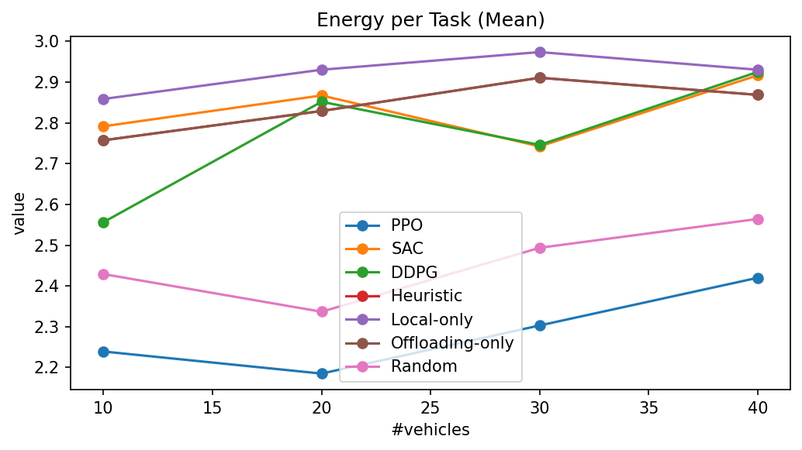
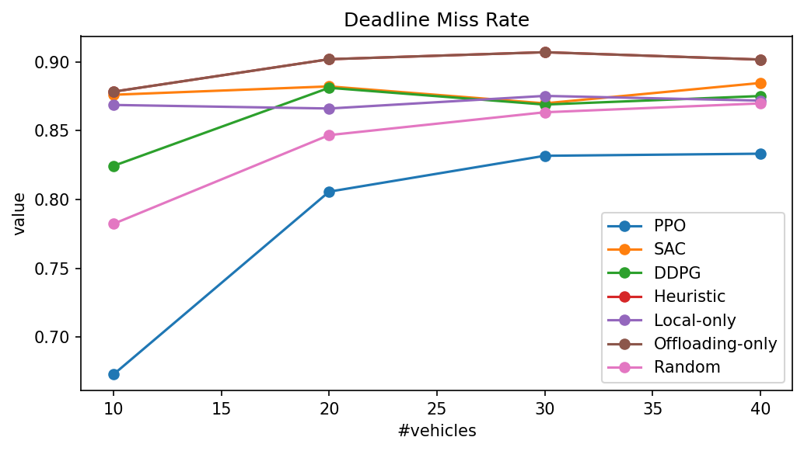

# EPTask on VEC Implementation Report

```
Student Name: Mahan Bayhaghi
Student ID: 400104834
```

> **Goal:** Priority-aware, energy-efficient task scheduling in a dynamic **Vehicular Edge Computing (VEC)** simulator aligned with EPTask’s approach.  
> **Claim to show:** **PPO** outperforms **DDPG**, **SAC**, and fixed baselines (**local-only, offloading-only, random**) on deadline-driven metrics.

---

## 1) Project Overview & Objectives

- **Problem.** Each arriving task must be scheduled (local/V2V/edge/cloud) and prioritized (4 levels), under mobility, bandwidth limits, and deadlines.
- **Objectives.**
  - Implement an EPTask-style simulator (Table-III radios/compute/tasks).
  - Train/evaluate **PPO**; compare against **SAC**, **DDPG**, **heuristic**, **local-only**, **offloading-only**, **random**.
  - Report: **deadline miss rate**, **mean energy**, **throughput**.
- **Key design choices.**
  - **Non-preemptive + EDF** service at executors (per requirement).
  - **Distance-based TX power (default)**; learned-power kept only for ablations.
  - **Poisson (bursty) arrivals** to induce realistic congestion.
  - **CPU-only**, Windows-friendly; configurations in YAML.

---

## 2) Implementation

### 2.1 Repository layout (what each module contains)

```txt
eptask/
├─ env/
│ ├─ vec_env.py         # Core Gymnasium env: queues, EDF service, reward, distance-based TX power
│ ├─ generators.py      # Task and vehicle generators (Poisson arrivals; 4 priority levels)
│ ├─ models.py          # Distance→SNR→rate, tx/compute time & energy helpers
│ ├─ spaces.py          # Action space (offload, priority[, power])
│ ├─ wrappers.py        # Wrapper for SAC/DDPG
│ ├─ metrics.py
│
├─ rl/
│ └─ utils.py           # Config loader and seeding
│
├─ scripts/
│ ├─ train.py           # PPO training
│ ├─ train_sac.py       # SAC training via action-space wrapper
│ ├─ train_ddpg.py      # DDPG training via action-space wrapper
│ ├─ eval.py            # Rollout a saved PPO model
│ ├─ eval_metrics.py    
│ ├─ baseline_heuristic.py # Heuristic, local-only, offloading-only, random (+ metrics)
│ ├─ rollout_data.py    
│ ├─ plot.py            # Learning curve / generic CSV plotter
│ ├─ plot_metrics.py    # Per-metric PNGs
│ ├─ run_grid.py        # Grid runner across {vehicles,seeds} for all methods
│ └─ plot_vs_vehicles.py# Per-metric lines vs #vehicles
│
└─ configs/
└─ default.yaml         # Table-III aligned defaults 
```


### 2.2 Environment dynamics (high level)

- **State (Dict).**
  - `global`: time, BW, noise, compute caps, K, levels.
  - `tasks`: size, cycles, age, time-to-deadline, energy cap, current priority, holder, active flag.
  - `targets`: local/V2V/edge/cloud indicators + queue lengths.
  - `vehicles`: position, speed, queue fullness, battery placeholder.
- **Action (per step, top-K tasks).**  
  `(offload target, priority)`; **(+ power_bin)** only when `power_rule: "bins"` (ablation).
- **Reward.**  
  `−(λ₁·z_completion_time + λ₂·z_energy) − λ₃·deadline_misses_step` with running (Welford) normalization.

### 2.3 Training processes

- **PPO (primary).**
  - Policy: **MultiInputPolicy** (Dict obs).
  - Rollout length `n_steps=2048`, lr=3e-4 (per Table-III suggestions), CPU device.
  - Action space uses only offload/priority by default (distance-based power inside env).

- **SAC & DDPG (comparators).**
  - Observation: **Dict** (same as PPO) → **MultiInputPolicy**.
  - Default SB3 hyperparameters chosen for CPU-friendly runs.

- **Fixed baselines.**
  - **Heuristic:** EDF + **min estimated finish time** (tx time + queue wait + compute time).
  - **Local-only / Offloading-only / Random:** simple strategies for lower/upper bounds.

---

## 3) Results

**Qualitative summary**
- **PPO** reduces **deadline miss rate** vs SAC, DDPG, and fixed baselines.
- **Energy per task** remains competitive with learning methods and better than fixed baselines under load.

### 3.1 Scalability across number of vehicles





**Qualitative summary**
- As **vehicles↑**, **offloading-only** deteriorates (shared V2I); **local-only** saturates compute.
- **PPO** adapts by balancing local/V2V/edge/cloud → **lower miss rate**.

---

## 4) Reproducing Results & Experiments

### 4.1 Install

```bash
pip install -r requirements.txt
python -m pytest -q
```

### 4.2 Single-config: train & evaluate all methods
```bash
# PPO
python scripts/train.py --config configs/default.yaml --timesteps 100000 --logdir runs/ppo
python scripts/eval_metrics.py --config configs/default.yaml --algo ppo  --model runs/ppo/latest_model.zip  --episodes 5 --out runs/ppo_metrics.csv

# SAC
python scripts/train_sac.py --config configs/default.yaml --timesteps 100000 --logdir runs/sac
python scripts/eval_metrics.py --config configs/default.yaml --algo sac  --model runs/sac/latest_model.zip  --episodes 5 --out runs/sac_metrics.csv

# DDPG
python scripts/train_ddpg.py --config configs/default.yaml --timesteps 100000 --logdir runs/ddpg
python scripts/eval_metrics.py --config configs/default.yaml --algo ddpg --model runs/ddpg/latest_model.zip --episodes 5 --out runs/ddpg_metrics.csv

# Fixed baselines (also write metrics CSVs)
python scripts/baseline_heuristic.py --config configs/default.yaml --episodes 5 --mode heuristic --out runs/heuristic_eval.csv --metrics_out runs/heuristic_metrics.csv
python scripts/baseline_heuristic.py --config configs/default.yaml --episodes 5 --mode local     --out runs/local_eval.csv     --metrics_out runs/local_metrics.csv
python scripts/baseline_heuristic.py --config configs/default.yaml --episodes 5 --mode offload   --out runs/offload_eval.csv   --metrics_out runs/offload_metrics.csv
python scripts/baseline_heuristic.py --config configs/default.yaml --episodes 5 --mode random    --out runs/random_eval.csv    --metrics_out runs/random_metrics.csv

python scripts/plot_metrics.py --out runs/final_compare.png
```

### 4.3 Scalability study (vary #vehicles, multi-seed)
```bash
# Run grid of {vehicles × seeds} for PPO/SAC/DDPG + baselines
python scripts/run_grid.py --config configs/default.yaml --vehicles 10 20 30 40 50 --seeds 0 1 2 --timesteps 100000 --episodes 5 --outdir runs/grid

python scripts/plot_vs_vehicles.py --indir runs/grid --outdir runs/grid_plots
```

### 4.4 Useful config switches (YAML)
```bash
# configs/default.yaml (env section)
arrival_model: "poisson"       # bursty arrivals (recommended)
task_arrival_lambda: 1.3       # avg tasks/step/vehicle
deadline_range: [20, 80]       # tighten/loosen to control miss rate

priority_levels: 4
top_k: 4
num_edges: 8
max_vehicles: 50               # scale experiments
```
